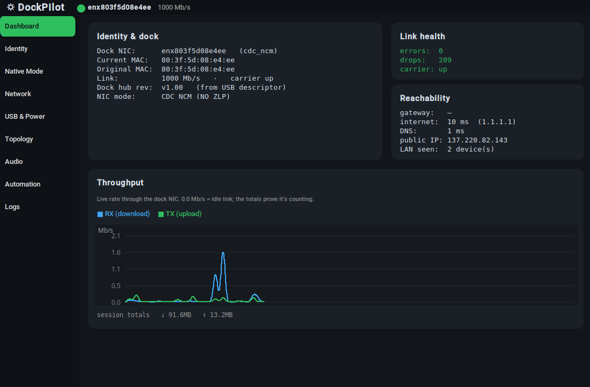
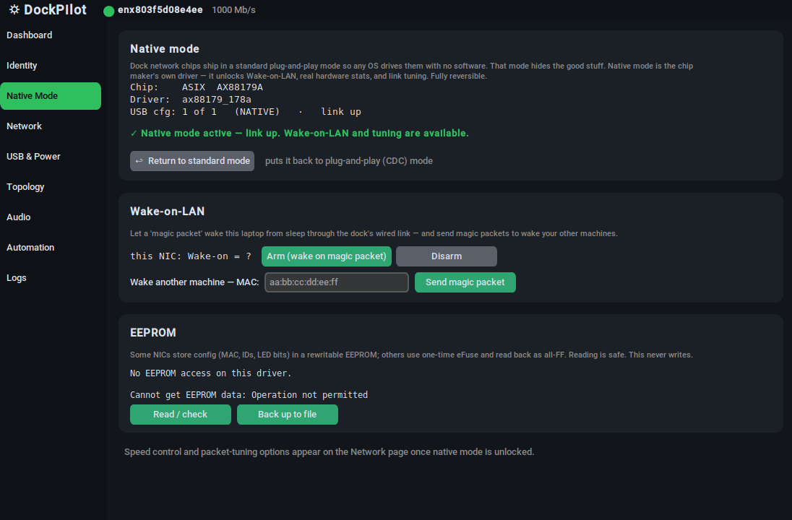
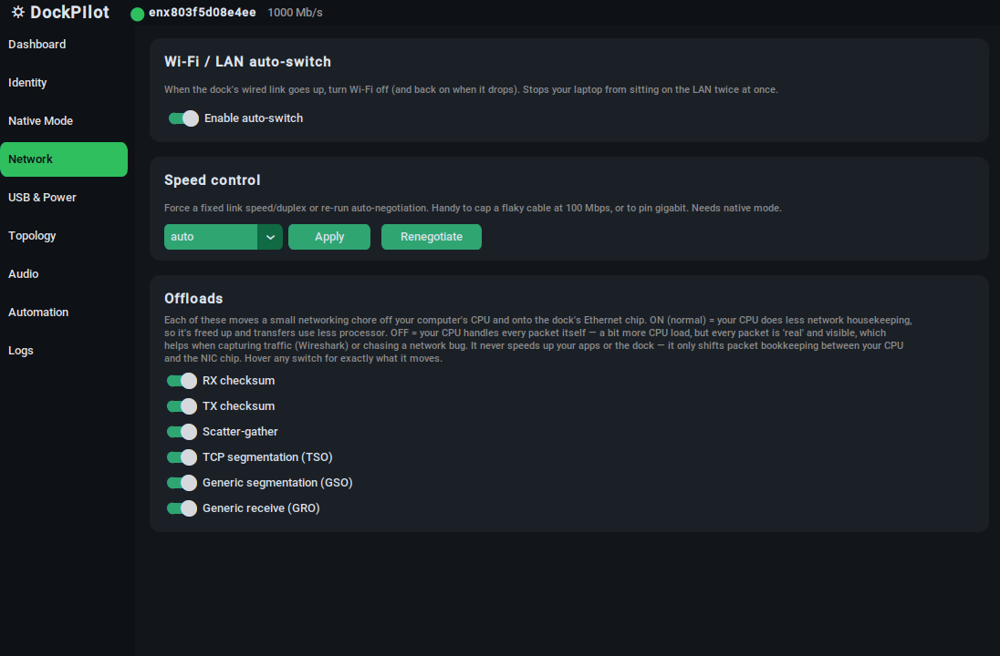
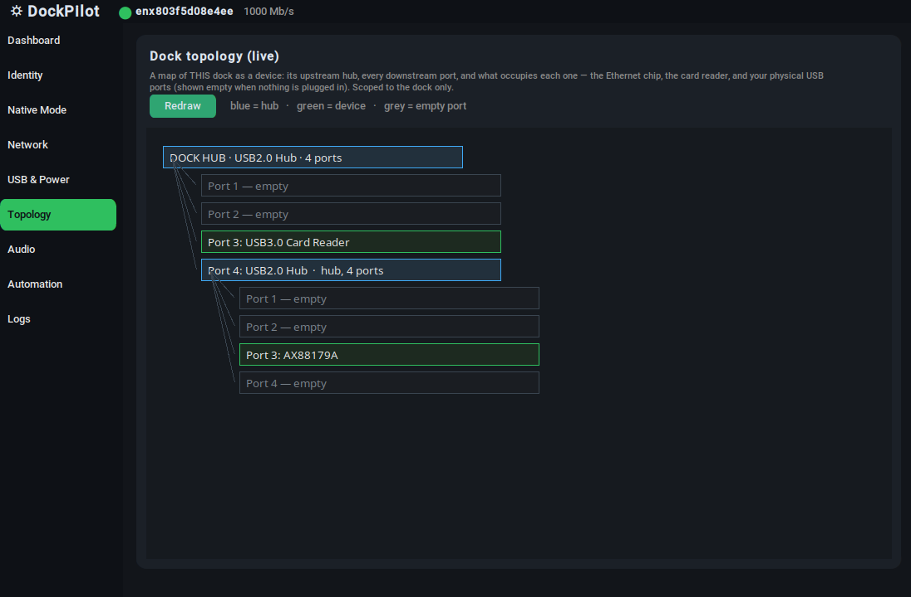
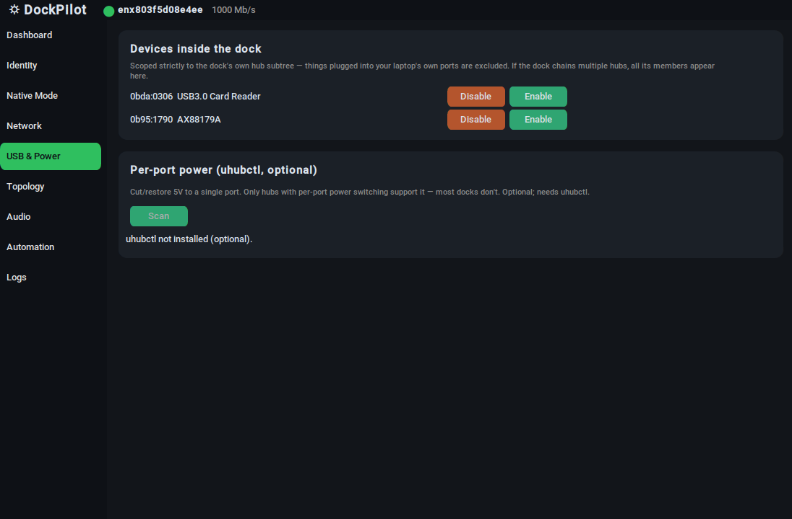
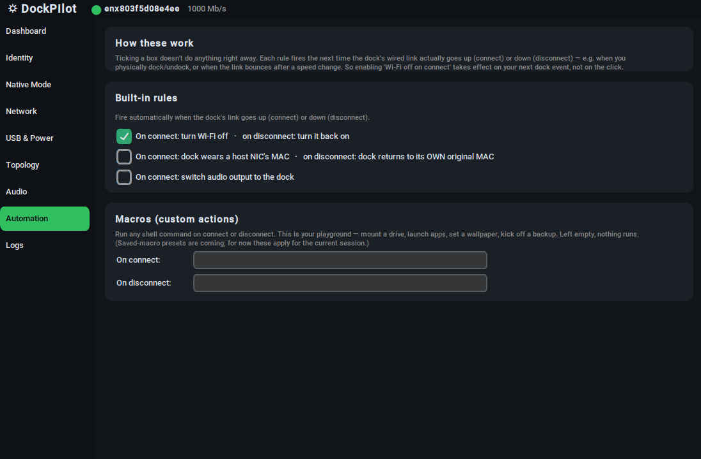

# DockPilot

A vendor-neutral **admin console for USB-C / Thunderbolt docks and hubs on Linux.**

Docks ship their network chips in a generic plug-and-play mode that hides most of what
the hardware can do — and on Linux, no vendor gives you a tool to change that. DockPilot
detects the dock's chipset and, **where the hardware allows**, safely and reversibly
unlocks the manufacturer's native mode (Wake-on-LAN, link tuning, EEPROM inspection),
draws a live map of the dock's internals, and controls its USB devices and audio.

Where a dock can do something, it unlocks it. Where a dock *can't*, it says so clearly and puts you back on a working configuration.



## Screenshots

| | |
|---|---|
| **Dashboard** — live throughput, link health, reachability, chip identity |  |
| **Native mode** — detect the chip and unlock the manufacturer's driver |  |
| **Wake-on-LAN** — arm the NIC and send magic packets to other machines |  |
| **USB topology** — a live map of the dock's hubs, ports and devices |  |
| **Devices & power** — enable/disable individual devices behind the dock |  |
| **Automation** — rules that fire when the dock connects or disconnects |  |

---

## What it does

- **Native-mode unlock (reversible).** Detects ASIX / Realtek dock NICs and, if they're in
  a limited plug-and-play (CDC) mode, offers a one-click switch to the native driver —
  then verifies the link actually comes up. If it does, native-only features appear. If it
  doesn't, it auto-reverts to the working mode and tells you why.
- **Wake-on-LAN.** Arm the dock NIC to wake the machine over the wired link, and send magic
  packets to wake your other machines (pure Python, no external tool).
- **Live dashboard.** Real-time throughput graph, link health (error/drop counters),
  reachability (gateway / internet / DNS latency, public IP, LAN device count), and the
  dock's chip identity — all from `/sys` and `ethtool`.
- **USB topology map.** A live diagram of the dock as a device: its hubs, every downstream
  port, and what occupies each — scoped strictly to the dock (your laptop's own ports are
  excluded). Falls back gracefully on hubs with no NIC.
- **Per-device USB control.** Enable/disable individual devices behind the dock; per-port
  power via `uhubctl` where the hub supports it.
- **Link & offload tuning** (native mode): force speed/duplex, renegotiate, toggle NIC
  offloads — each with a plain-language explanation of what it actually does.
- **EEPROM inspection.** Read-only: reports whether the NIC has a rewritable EEPROM or uses
  one-time eFuse, and can back it up. Never writes.
- **Connect/disconnect automation.** Rules that fire when the dock link goes up/down
  (e.g. turn Wi-Fi off when wired, MAC pass-through), persisted across restarts.

## What it does **not** do

- It does not talk to HDMI/DisplayPort video or Power Delivery — those aren't on the USB
  data bus and no USB tool can see them (it labels them).
- It cannot make a dock do something its silicon can't. Some chips (see below) engage
  native mode but their wired link never comes up — DockPilot diagnoses that and reverts,
  it does not "fix" the hardware.
- It writes nothing to any EEPROM/eFuse. Inspection only.
- Linux only. Uses NetworkManager for some conveniences (degrades gracefully without it).

---

## Tested hardware

Every device below was tested on a real machine.

| Device | NIC chip | Ships as | Native mode result |
|---|---|---|---|
| Wavlink WL-UMD05 REV.C | ASIX **AX88179A** | `cdc_ncm` | ✅ unlocks, link comes up |
| UGREEN Revodok Pro (10-in-1) | ASIX **AX88179B** | `cdc_ncm` | ⚠️ engages, but wired link won't come up — auto-reverts, diagnosed |
| TP-Link UE300C | ASIX **AX88179B** | `cdc_ncm` | ⚠️ same as above — diagnosed, reverts |
| Anker USB-C Gigabit adapter | ASIX **AX88179B** | `cdc_ncm` | ⚠️ same as above — diagnosed, reverts |
| uni USB-C Hub 6-in-1 | Realtek **RTL8153** | `r8152` | ✅ already native out of the box |
| TP-Link UE302C (2.5G) | Realtek **RTL8156** | `r8152` | ✅ already native; advertises 2500baseT/Full |
| MOKiN / C-Smartlink DK1903A (Thunderbolt 4, 12-in-1) | Realtek **RTL8156B** | `r8152` | ✅ already native; works fully over Thunderbolt |
| ASIX AX88772B USB-A adapter (10/100) | ASIX **AX88772B** | `asix` | ✅ single USB config — nothing to unlock; correctly offers no native mode |
| Lemorele 10-in-1 | *(no NIC)* | — | ✅ graceful: "no network chip", topology still drawn |

### The key finding

- **Realtek (RTL8153 / RTL8156)** native mode works — the chips ship on the native `r8152`
  driver and link cleanly, gigabit and 2.5G alike.
- **Current-generation ASIX (AX88179B)** native mode is **broken on current Linux**: the
  native `ax88179_178a` driver binds, but the Ethernet PHY never links (`carrier` stays
  down). Only the older **AX88179A** links correctly.

DockPilot handles both: it unlocks the chips that work, and for the ones that don't, it
engages native mode, detects the dead link, reverts to the working standard mode, and
explains why — remembering the verdict per-dock so it won't retry blindly.

---

## Install & run

Requires Python 3 with Tk (`python3-tk` on Debian/Ubuntu if your Python lacks it).

### Option 1 — install via pip (recommended)

```bash
python3 -m venv venv
source venv/bin/activate
pip install --upgrade pip
pip install dockpilot
dockpilot
```

### Option 2 — run from source

```bash
git clone https://github.com/dinnerisserved/dockpilot.git && cd dockpilot
python3 -m venv venv && source venv/bin/activate
pip install -r requirements.txt
python3 dockpilot.py
```

Optional system tools unlock extra panels (each auto-hides if absent): `ethtool` (link tuning, WoL, EEPROM), `usbutils`, `uhubctl` (per-port power), `network-manager`/`nmcli` (Wi-Fi auto-switch, reconnect), `pactl` (audio).

```bash
sudo apt install ethtool usbutils uhubctl network-manager  # all optional
```

Privileged actions (mode switching, WoL) prompt once via `pkexec` (a polkit dialog), not `sudo` — you never run the whole app as root.

## Configuration

Config lives in `./config/` next to the script — nothing is written to your home directory,
and **no personal data ships with the project**:

- `config/automation.json` — your connect/disconnect rules (created when you set them)
- `config/dock_memory.json` — remembered per-dock native-mode verdicts
- `config/dock_state.json` — captured original MAC (so "reset MAC" always works)

---

## Notes

Detail for people who want it — skip unless you're digging in.

**How native-mode unlock works.** USB devices can present multiple *configurations*. Many
ASIX/Realtek dock NICs ship on a generic CDC config (driven by `cdc_ncm`/`cdc_ether`), which
hides the chip's advanced features. Their native/vendor config exposes everything, driven by
`ax88179_178a` (ASIX) or `r8152` (Realtek). DockPilot switches by writing the device's
`bConfigurationValue` in sysfs, then re-checks the driver and link, and reverts if the link
doesn't come up. Fully reversible — unplugging the dock always returns it to standard mode.

**The AX88179B problem is upstream, not ours.** It's independently reported on the Linux
kernel mailing list ("ax88179_178a … Link status is: 0"). Four devices from three brands
reproduce it here.

**`r8152-cfgselector`.** Recent kernels ship a helper that performs the same
`bConfigurationValue` switch for Realtek NICs automatically at plug-in. So modern Realtek
devices increasingly arrive already-native, and DockPilot's unlock is most valuable on
**ASIX**, where no such helper exists.

**Thunderbolt docks.** The TB4 dock tested tunnels **USB** over Thunderbolt rather than
presenting a PCIe NIC, so DockPilot manages it exactly like a USB-C dock — no special
handling needed. It's also the only dock tested where `fwupd` sees dock-side firmware (Intel
USB3.0 Hub, USB4 Retimer); cheap USB-C docks show nothing. It needs a genuine Thunderbolt
cable — a normal USB-C cable silently drops it to USB 2.0 with no error.

**2.5G links.** An RTL8156 advertises 2500baseT/Full but only *links* at 2.5G if the other
end is also 2.5G; on gigabit infrastructure it negotiates to 1000Mb/s. DockPilot reports
advertised modes and negotiated speed separately. On one dock `ethtool` misreported the
advertised modes (claiming 10baseT on a 2.5G chip) while sysfs correctly showed 1000 —
worth knowing that advertised-modes output isn't always trustworthy.

**EEPROM in practice.** Across nine devices, only one exposes a readable EEPROM: the older ASIX
**AX88772B**, where the layout is fully decodable — MAC at `0x0008`, VID/PID at `0x0048`, vendor
strings at `0xC0`. Everything else reads back as all-`FF` (the chip uses one-time eFuse) or reports
no EEPROM access at all. Writing was rejected on every device tested; on the AX88772B the driver
logs *"Failed to enable software MII access"*, so `ethtool -E` can't reach the write path.
DockPilot therefore treats EEPROM as **read-only**, which is all it ever claimed to do.

**Built on.** The Linux `ax88179_178a` and `r8152` drivers; Realtek's own udev rule for
forcing native mode; `uhubctl` for per-port power; `ethtool`, `fwupd`, and the sysfs USB/net
interfaces. What DockPilot adds is the synthesis: detect the chip, attempt the unlock, verify
it works, degrade honestly when it doesn't, and present it in a GUI.

## License

See [LICENSE](LICENSE).

## Disclaimer

DockPilot changes low-level USB/network device state on hardware you own. Mode switches are
reversible and the app is careful, but you use it at your own risk. It never writes firmware
or EEPROM.
